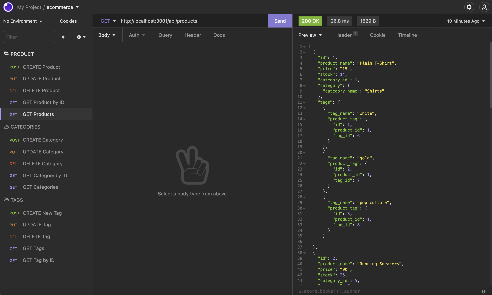

## E-Commerce Backend (ORM)
The back-end was created to add to an exisiting starter code for an E-Commerce site. I configured a working Express.js API (server) to use Sequelize (ORM) to interact with a MySQL database to run SQL models and queries. The link in Usage demonstrates how the API Routes are used to perform RESTful CRUD operations. Users can view, add, edit, and delete categories, products, and tags.

## Installation

Please install the following: init, mysql2, Dotenv, and Sequelize. To connect to the database, run mysql -u root -p in your terminal and enter the password from the .env file, source the schema.sql by entering source db/schema.sql , then enter use ecommerce_db and then quit. Proceed by seeding the file by entering npm run seed and then npm start. 

## Usage 
Demo Link: https://watch.screencastify.com/v/BgtHYYbjBT5aCX53DiRN
Repo link: https://github.com/annielnguyen/ecommerce-backend

## Questions

My GitHub profile link is: https://github.com/annielnguyen. If you have any questions regarding this app, please contact directly at: anguyen.aln@gmail.com.

